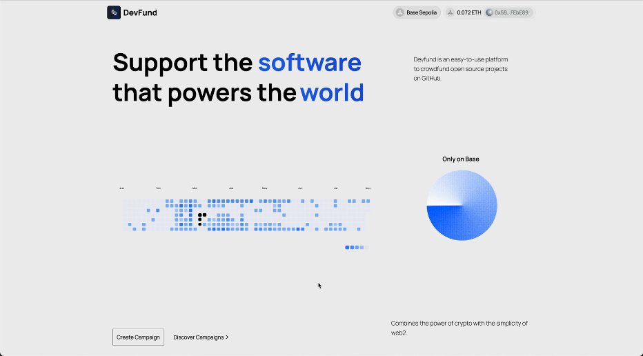

# DevFund


**DevFund** is a platform for developers to fund open source projects. It connects developers with potential sponsors who are interested in supporting innovative and impactful projects.



## 🚀 Quick Start

- **GitHub Repo**: [DevFund](https://github.com/satyasandeep007/devfund)
- **Demo Video**: [Watch on YouTube](https://youtu.be/gJgZK04CUXU)

## 🌟 Problem

Existing platforms restrict donations to fiat currencies 💸, create overly complex crypto transactions 🔐, and have lengthy approval processes ⏳ that delay funding for developers.

## 💡 Solution

DevFund provides a streamlined platform that enables flexible donations in both fiat and cryptocurrency 🌍, simplifies the donation process for users 🔄, and allows for quick campaign approvals ⚡, ensuring timely funding for developers.

### 🚀 Features

**DevFund** enables users to:

- 🪙 Connect their wallet.
- 💳 Create campaigns and withdraw donated funds.
- 💳 Buy USDC, donate to campaigns, and receive an NFT as a token of appreciation.
- 📲 View a dashboard of all tokens and NFTs.

## 🛠️ Tech Stack

- Base Sepolia Chain
- Next.js
- TypeScript
- TailwindCSS
- Alchemy SDK
- On-ramp

## 📚 Installation & Setup

1. **Clone the repository**

   ```bash
   git clone https://github.com/satyasandeep007/devfund
   cd devfund
   ```

2. **Install All Dependencies**
   Run the following command to install dependencies:

   ```bash
   pnpm install
   ```

3. **Run the Application**
   You can start all services (Frontend, Proxy Server, and Snap) with the following command:
   ```bash
   pnpm run dev
   ```

## 🚀 Running the App

Visit `http://localhost:3000` in your browser to access the application.

## Resources

- **USDC**: [0xD733D48f2a7F57D4559F98ae07f87Dab595E3523](https://sepolia.basescan.org/address/0xd733d48f2a7f57d4559f98ae07f87dab595e3523)
- **NFT**: [0x2f8b248b69208647865B47f35B7784B348c6bbd0](https://sepolia.basescan.org/address/0x2f8b248b69208647865b47f35b7784b348c6bbd0)
- **Main**: [0xCe5609b1a715EB39B8dADBadcc8409e4a2739689](https://sepolia.basescan.org/address/0xce5609b1a715eb39b8dadbadcc8409e4a2739689)

## 👥 Meet the Team

<table>
  <tr>
    <td align="center">
      <a href="https://github.com/shivamangina">
        <br />
        <sub><b>Shiva Kumar</b></sub>
      </a><br />
      <a href="https://www.linkedin.com/in/shivamangina/" title="LinkedIn">💼</a>
      <a href="https://twitter.com/shivakmangina" title="Twitter">🐦</a>
    </td>
    <td align="center">
      <a href="https://github.com/satyasandeep007">
        <br />
        <sub><b>Sandeep Kumar</b></sub>
      </a><br />
      <a href="https://www.linkedin.com/in/satyasandeep" title="LinkedIn">💼</a>
      <a href="https://twitter.com/satyasandeep76" title="Twitter">🐦</a>
    </td>
    <td align="center">
      <a href="https://github.com/vinay4656">
        <br />
        <sub><b>Vinay Godawarthi</b></sub>
      </a><br />
      <a href="https://www.linkedin.com/in/vinaygodawarthi/" title="LinkedIn">💼</a>
      <a href="https://twitter.com/vinaygodawarthi" title="Twitter">🐦</a>
    </td>
  </tr>
</table>
